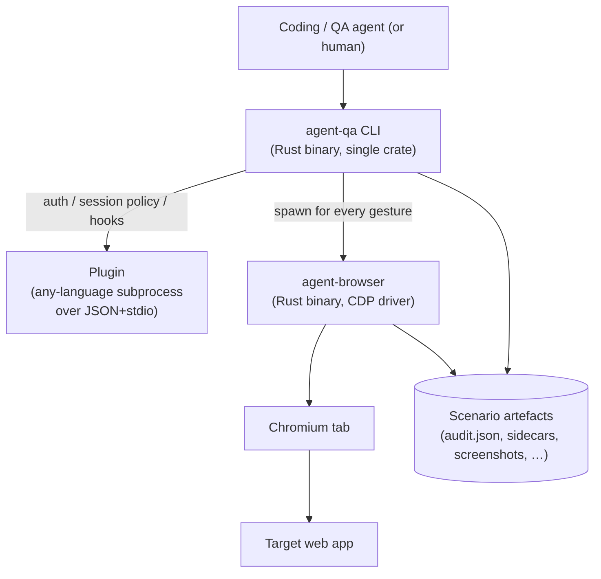
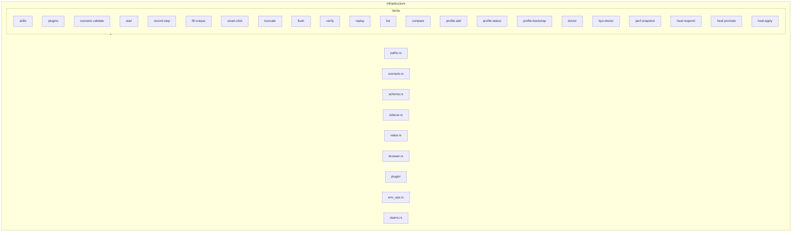
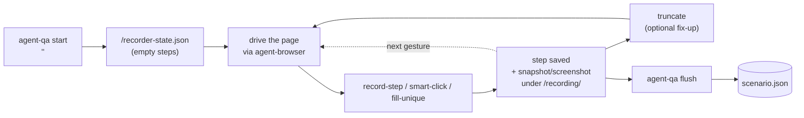
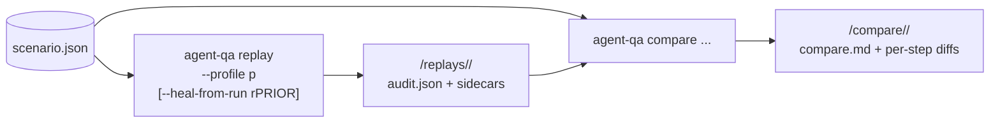
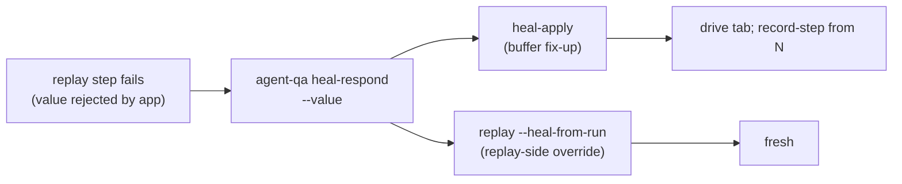

# Architecture

For humans who need to know how the binary fits together before changing it.

## Scope

`agent-qa` records and replays user scenarios. It is not a browser
automation framework, and it is not an in-page capture pipeline. It is
the orchestration layer that ties browser actions, page-produced
signals, profiles, sidecars, replay, compare, and heal into one audit
trail.

## Where it sits



The arrow that matters: agent-qa depends on agent-browser. Never the
other way around. agent-qa never forks or shadows agent-browser.

The plugin arm is how every app-specific concern enters the system.

## Inside the binary

Single Rust crate at `cli/`. One module per verb plus shared
infrastructure under `cli/src/`. No multi-crate workspace; matches
`agent-browser`'s shape.



Every verb is a module exporting a `pub fn run(args: &[String]) -> Result<u8>`.
`main.rs` is the dispatcher; adding a verb is one mod entry plus one
match arm.

## Recording flow



`recorder-state.json` owns typed recording metadata, setup operations,
source provenance, frozen local browser connection, and direct scenario steps.
The sealed scenario never contains the local CDP endpoint or pin policy.

The serial gate is real. The next browser action waits for `record-step` to
return before mutating page state; otherwise the keyframe captures the wrong
state.

## Replay and compare flow



Replay is one profile per invocation. Compare diffs two replay runs
(snapshot text + screenshot pixels per step).

## Heal pipeline



Two consumer paths for the heal-response file:
1. `heal-apply` patches the recording buffer in place; the next
   `record-step` continues from the corrected state.
2. `replay --heal-from-run <prior>` patches step values at dispatch;
   no edits to `scenario.json` or buffer.

`heal-promote` is a third consumer that rewrites locator drift in
`scenario.json` directly (with sha256 rebase guard).

## Artefacts on disk

```
<scenarios_root>/<sid>/
├── scenario.json                 sealed contract
├── recording/                   recording-side sidecars
│   ├── snapshots/<stepId>.txt
│   ├── screenshots/<stepId>.png
│   ├── network/<stepId>.json
│   ├── probes/<stepId>.json
│   ├── audit.json
│   ├── heal.jsonl
│   └── failed/truncate-<isoTs>[-tag]/
├── replays/<runId>/
│   ├── audit.json
│   ├── snapshots/<stepId>.txt
│   ├── screenshots/<stepId>.png
│   └── heal-responses/<stepId>.json (or .applied.json after heal-apply)
├── compare/<TS>__<runA>-vs-<runB>/
│   ├── compare.md
│   ├── snapshots/<stepId>.diff
│   └── screenshots/<stepId>.diff.png
└── perf/<TS>.json               optional perf snapshot
```

Default root: `<cwd>/tmp/agent-qa-scenarios/`. Override with
`AGENT_QA_SCENARIOS_DIR`. The recorder's workfiles live separately at
`<cwd>/tmp/agent-qa-record/` (override: `AGENT_QA_RECORD_DIR`).

## Invariants

- agent-qa wraps agent-browser. It never duplicates browser-level work.
- Sidecars are plain files: JSON, JSONL, Markdown, text, PNG. No opaque
  state.
- Recording is serial. Action first, `record-step` second, next action
  third.
- Targets are user-perceived: ARIA roles, accessible names, URL
  patterns. No CSS-framework selectors leak into core. `Locator::Raw`
  is the named-and-shamed escape hatch.
- Core code stays generic. No vendor names, no app-specific routes,
  no hard-coded GraphQL operation names. Vendor concerns live in
  plugins.
- Plugin protocol stays simple: subprocess, JSON over stdio, one
  `<plugin> <kind> [<op>]` invocation per call.

## Codemap

| Area                 | Modules                                                |
| -------------------- | ------------------------------------------------------ |
| CLI dispatch         | `cli/src/main.rs`                                      |
| Recording verbs      | `start.rs`, `record_step.rs`, `fill_unique.rs`, `smart_click.rs`, `truncate.rs`, `flush.rs`, `verify.rs` |
| Replay               | `runner.rs`, `verbs.rs`, `verb_shape.rs`, `claims.rs`, `env_ops.rs`, `value.rs`, `sidecar.rs` |
| Compare              | `compare/mod.rs`, `compare/screenshots.rs`             |
| Heal                 | `heal_respond.rs`, `heal_promote.rs`, `heal_apply.rs`, `runner.rs` (`--heal-from-run`) |
| Profiles             | `profile_add.rs`, `profile_status.rs`, `profile_bootstrap.rs` |
| Diagnostics          | `doctor.rs`, `byo_doctor.rs`, `perf_snapshot.rs`       |
| Browser client       | `browser.rs`                                           |
| Plugin host          | `plugin/protocol.rs`, `plugin/discovery.rs`, `plugin/host.rs`, `plugin/cli.rs` |
| Paths                | `paths.rs`                                             |
| Scenario types        | `scenario.rs`, `schema.rs`                              |
| Operational refs     | `skill-data/`                                          |

## What agent-qa is _not_

- Not a unit-test runner. Unit tests check module internals; scenarios
  check product behaviour from the outside.
- Not a load test or synthetic monitor.
- Not a full visual baseline product. Screenshot pixel diffs exist;
  approval-workflow tooling (Percy / Chromatic) is out of scope.
- Not an in-page capture classifier. Anything app-specific belongs in
  a plugin or in the page itself.

## Known drift to watch

- README drift — the README is a landing page, not a verb reference.
  If you find yourself typing flag tables there, stop and update each
  verb's `--help` output instead.
- Skill drift — when a verb's flags or output change, update
  `skill-data/core/SKILL.md` and the matching reference.
- Artefact path drift — paths come from `cli/src/paths.rs`.
  Recomputing `scenario_dir.join(...)` inline is how artefacts end up
  in two places.
