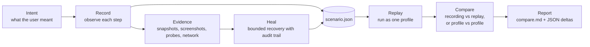

# agent-qa: the whole system in one read

Read this when the pieces feel disconnected and you want the mental model in one pass. About 10 minutes.

## The problem

A browser test that goes green is not the same as a user who can finish the task. The button might have moved. The
modal might be hidden behind a feature flag. The server might accept the request but return the wrong shape. A
non-admin might see a different page. None of these show up if your test only asserts "I see a 200."

agent-qa records the scenario through the product as a sealed document, and keeps the evidence on disk. When
something changes, you don't get pass/fail — you get the diff.

## The shape

Two layers. Keep them straight and most confusion goes away.

| Layer                       | Owns                                                                            |
| --------------------------- | ------------------------------------------------------------------------------- |
| `agent-browser`             | Driving the browser. CDP, navigation, snapshots, screenshots, eval.             |
| `agent-qa`                  | Scenario bookkeeping. Profiles, sidecars, replay, compare, heal.                 |

agent-qa calls down into agent-browser for everything it does to the page. It never reimplements
what agent-browser already provides.

## The loop



One rule keeps the loop honest: every claim has an artifact behind it. "It passed" without files is not a result.

## What a scenario is

A `scenario.json` is an ordered list of steps. Each step has a kind — navigate, click, fill, wait, assert, control
flow, host action — and a target expressed in user-perceived terms: role, accessible name, label, URL pattern.
Class names and selectors are not targets, because users don't perceive them.

The scenario is the contract. Once flushed, you don't edit it by hand; you re-record or heal.

## Where evidence lives

Default root: `tmp/agent-qa-scenarios/<sid>/`. Override with `AGENT_QA_SCENARIOS_DIR`.

| Directory      | What it holds                                                                       |
| -------------- | ----------------------------------------------------------------------------------- |
| `scenario.json` | The sealed scenario itself.                                                          |
| `snapshots/`   | ARIA / accessibility tree text snapshots, one per step.                             |
| `screenshots/` | PNG screenshots, one per step.                                                      |
| `probes/`      | DOM failure signals — alerts, dialogs, toasts, `aria-invalid`, URL state.           |
| `network/`     | GraphQL and REST request/response bodies around each step.                          |
| `replays/`     | Replay manifests + replay-side evidence, one folder per replay run.                 |
| `compare/`     | `compare.md` plus JSON / JSONL deltas, one folder per compare run.                  |
| `failed/`      | Heal stores, assert refusals, quarantine evidence.                                |
| `perf/`        | Optional `perf-snapshot` output.                                                    |
| `templates/`   | Reusable sub-scenarios loaded by `runTemplate` — see [`templates.md`](templates.md). |

Every path is computed by `cli/src/paths.rs`. Don't recompute them elsewhere.

## How recording works

Recording is **serial**, by design.

1. You (or an agent) drive the page.
2. `agent-qa record-step <kind> <json>` observes the settled page and writes the step + its evidence.
3. Only after `record-step` returns do you take the next action.

The order matters. If you fire the next browser action before `record-step` finishes, the keyframe captures the
wrong state and the replay will be lying about what it saw.

The exact loop — what verbs to use in what order, what `smart-click` does, when to `fill-unique`, how to assert —
lives in the runtime skill:

```bash
agent-qa skills core
```

That's the source of truth. This doc is the _why_; the skill is the _how_.

## How replay works

Replay is deterministic. No LLM in the loop. The engine reads `scenario.json`, resolves each step's target against
the live page, substitutes saved bindings and template values, performs the action, and writes a replay manifest
under `replays/<replayId>/`.

Replay runs **one profile per invocation**. To compare profiles, run replay twice (or N times), then `compare`.

## How compare works

`compare` diffs two things from disk and writes a report folder:

- A recording against one of its replays.
- One replay against another (same scenario, different profile or different run).

It can include two kinds of evidence:

- ARIA snapshot text diffs (what an accessibility user would perceive).
- Screenshot pixel diffs + side-by-side triptychs.

Output is `compare/<run>/compare.md` plus JSON for machines.

## How healing works

Healing is **not** "make the red test green." It's a bounded recovery for recording-time failures, with an audit
trail. The shape:

1. A step fails or looks wrong.
2. `inspect` and probe / network evidence explain what happened.
3. An agent or human writes a patch with a diagnosis.
4. `apply-heal` merges the patch over the original step and stores the stale evidence under `failed/`.
5. The scenario is replayed or re-recorded from a known point.
6. The heal is marked success or failure.

Never heal an explicit assertion to hide a regression. If the contract failed, report it.

## Where to change things

| Change                    | Start here                                                     |
| ------------------------- | -------------------------------------------------------------- |
| Add or change a CLI verb  | `cli/src/main.rs`, then `AGENTS.md` Rule 6.                    |
| Move or rename artifacts  | `cli/src/paths.rs`.                                            |
| Profile resolution / auth | `cli/src/profile_*.rs` + the configured `auth` plugin.         |
| Recording behavior        | `cli/src/record_step.rs`, `cli/src/start.rs`, `cli/src/flush.rs`. |
| Replay behavior           | `cli/src/runner.rs`, `cli/src/verbs.rs`.                       |
| Compare behavior          | `cli/src/compare/mod.rs`, `cli/src/compare/screenshots.rs`.    |
| Heal behavior             | `cli/src/heal_respond.rs`, `cli/src/heal_apply.rs`, `cli/src/heal_promote.rs`, `cli/src/runner.rs`. |
| Operational reference     | `skill-data/core/SKILL.md` and `skill-data/core/references/*`. |

## Read next

- [`architecture.md`](architecture.md) — codemap and runtime flows.
- [`verbs.md`](verbs.md) — complete CLI verb reference.
- [`templates.md`](templates.md) — reusable sub-scenarios.
- [`decisions/0002-agent-qa-wraps-agent-browser.md`](adr/0002-agent-qa-wraps-agent-browser.md) — the boundary decision.
- `agent-qa skills core` — when you're about to record.
